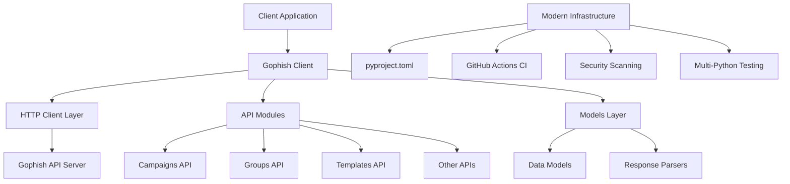

# Design Document: Python Modernization

## Overview

This design outlines the comprehensive modernization of the Gophish Python API client library to support Python 3.8-3.12 and upgrade all dependencies to their latest secure versions. The modernization follows current Python packaging standards while maintaining backward compatibility with existing APIs.

The approach prioritizes security, maintainability, and developer experience by adopting modern Python practices including pyproject.toml configuration, comprehensive CI/CD pipelines, and automated dependency management.

## Architecture

### Current Architecture Analysis

The existing codebase follows a simple client-server API wrapper pattern:
- `gophish.client.Gophish`: Main client class
- `gophish.api.*`: API endpoint modules (campaigns, groups, templates, etc.)
- `gophish.models`: Data models for API responses
- Synchronous HTTP requests using the `requests` library

### Modernized Architecture

The modernized architecture maintains the same public API while upgrading the underlying infrastructure:



## Components and Interfaces

### 1. Package Configuration System

**pyproject.toml Configuration**
- Primary configuration file following PEP 621 standards
- Declarative metadata and dependency specification
- Build system configuration using setuptools backend
- Development dependencies separated from runtime dependencies

**Backward Compatibility Layer**
- Maintain setup.py for legacy tooling compatibility
- Ensure existing installation methods continue to work
- Gradual migration path for users

### 2. Dependency Management System

**Core Dependencies Update Strategy**
- `requests`: Upgrade from 2.24.0 to latest (2.32.3+) for security fixes
- `python-dateutil`: Upgrade from 2.8.1 to latest (2.8.2+)
- `certifi`: Upgrade from 2020.6.20 to latest for certificate updates
- Remove pinned versions of transitive dependencies (urllib3, chardet, idna)

**Version Range Strategy**
```toml
dependencies = [
    "requests>=2.32.0,<3.0.0",
    "python-dateutil>=2.8.2",
    "certifi>=2023.7.22"
]
```

### 3. Python Version Support Matrix

**Supported Versions**
- Python 3.8: Minimum supported version (EOL October 2024)
- Python 3.9: LTS support
- Python 3.10: Current stable
- Python 3.11: Performance improvements
- Python 3.12: Latest features and optimizations

**Compatibility Strategy**
- Use `python_requires=">=3.8"` in configuration
- Avoid Python 3.12-specific features for broader compatibility
- Test against all supported versions in CI

### 4. Testing Infrastructure

**Multi-Matrix CI Strategy**
```yaml
strategy:
  matrix:
    python-version: ["3.8", "3.9", "3.10", "3.11", "3.12"]
    os: [ubuntu-latest, windows-latest, macos-latest]
```

**Test Categories**
- Unit tests: Core functionality validation
- Integration tests: API endpoint testing (with mocking)
- Compatibility tests: Cross-version Python compatibility
- Security tests: Dependency vulnerability scanning

### 5. Code Quality System

**Static Analysis Tools**
- `black`: Code formatting (PEP 8 compliance)
- `flake8`: Linting and style checking
- `mypy`: Type checking (gradual typing adoption)
- `bandit`: Security vulnerability scanning

**Quality Gates**
- All tests must pass on all supported Python versions
- Code coverage minimum threshold (80%)
- No security vulnerabilities in dependencies
- Consistent code formatting

## Data Models

### Configuration Data Model

```python
# pyproject.toml structure
[build-system]
requires = ["setuptools>=61.0", "wheel"]
build-backend = "setuptools.build_meta"

[project]
name = "gophish"
version = "0.6.0"
description = "Python API Client for Gophish"
authors = [{name = "Jordan Wright", email = "python@getgophish.com"}]
license = {text = "MIT"}
readme = "README.md"
requires-python = ">=3.8"
classifiers = [
    "Development Status :: 4 - Beta",
    "Intended Audience :: Developers",
    "License :: OSI Approved :: MIT License",
    "Programming Language :: Python :: 3",
    "Programming Language :: Python :: 3.8",
    "Programming Language :: Python :: 3.9",
    "Programming Language :: Python :: 3.10",
    "Programming Language :: Python :: 3.11",
    "Programming Language :: Python :: 3.12",
]
dependencies = [
    "requests>=2.32.0,<3.0.0",
    "python-dateutil>=2.8.2",
    "certifi>=2023.7.22"
]

[project.optional-dependencies]
dev = [
    "pytest>=7.0.0",
    "pytest-cov>=4.0.0",
    "black>=23.0.0",
    "flake8>=6.0.0",
    "mypy>=1.0.0",
    "bandit>=1.7.0"
]

[project.urls]
Homepage = "https://github.com/gophish/api-client-python"
Repository = "https://github.com/gophish/api-client-python"
Documentation = "https://docs.getgophish.com/python-api-client/"
```

### Migration Data Model

```python
# Migration tracking for breaking changes
class MigrationInfo:
    old_version: str
    new_version: str
    breaking_changes: List[str]
    migration_steps: List[str]
    compatibility_notes: str
```

## Correctness Properties

*A property is a characteristic or behavior that should hold true across all valid executions of a system-essentially, a formal statement about what the system should do. Properties serve as the bridge between human-readable specifications and machine-verifiable correctness guarantees.*

Based on the prework analysis, the following properties have been identified for testing:

### Property Reflection

After reviewing all testable acceptance criteria, several properties can be consolidated:
- Properties 2.1, 2.2, 2.4 can be combined into a comprehensive dependency compatibility property
- Properties 5.1, 5.2, 5.4 can be combined into a code quality property
- Properties 6.1, 6.3, 6.4, 6.5 can be combined into a security compliance property

### Core Properties

**Property 1: Multi-Python Version Compatibility**
*For any* supported Python version (3.8-3.12), installing and importing the Gophish client should succeed and all core functionality should work correctly
**Validates: Requirements 1.1, 1.4**

**Property 2: Version Constraint Enforcement**
*For any* Python version below 3.8, attempting to install the package should fail with a clear error message indicating the minimum required version
**Validates: Requirements 1.2, 1.3**

**Property 3: Dependency Compatibility and Security**
*For any* installation of the package, all dependencies should be at secure versions, resolve without conflicts, and maintain API compatibility with existing code
**Validates: Requirements 2.1, 2.2, 2.3, 2.4, 2.5**

**Property 4: Package Metadata Completeness**
*For any* package build, the metadata should include all required fields (name, version, author, license, classifiers) and development dependencies should be separate from runtime dependencies
**Validates: Requirements 3.3, 3.4**

**Property 5: CI Pipeline Functionality**
*For any* CI pipeline execution, tests should run on all specified Python versions and operating systems, and deployment should be blocked if any tests fail
**Validates: Requirements 4.4, 4.5**

**Property 6: Code Quality and Modernization**
*For any* code in the package, it should pass static analysis tools, be compatible with type hints, use modern Python features, and maintain existing API interfaces
**Validates: Requirements 5.1, 5.2, 5.3, 5.4, 5.5**

**Property 7: Security Compliance**
*For any* security scan of the package, no known vulnerabilities should be present in dependencies, SSL verification should be enabled by default, and secure communication protocols should be used
**Validates: Requirements 6.1, 6.3, 6.4, 6.5**

**Property 8: Documentation Completeness**
*For any* major use case or API endpoint, working examples should be provided in the documentation and all examples should work with the current version
**Validates: Requirements 7.3, 7.5**

**Property 9: Release Automation**
*For any* release process, PyPI publishing should only occur after all tests pass and modern GitHub Actions versions should be used throughout the pipeline
**Validates: Requirements 8.2, 8.4, 8.5**

## Error Handling

### Dependency Resolution Errors
- **Conflict Detection**: Implement pre-installation dependency conflict checking
- **Clear Error Messages**: Provide actionable error messages for version conflicts
- **Fallback Strategies**: Suggest alternative dependency versions when conflicts occur

### Python Version Compatibility Errors
- **Early Detection**: Fail fast during installation on unsupported Python versions
- **Informative Messages**: Include upgrade instructions in error messages
- **Graceful Degradation**: Maintain functionality on older supported versions

### Security Vulnerability Handling
- **Automated Scanning**: Integrate security scanning into CI/CD pipeline
- **Vulnerability Reporting**: Generate detailed reports with remediation steps
- **Emergency Updates**: Process for rapid security patch deployment

### API Compatibility Errors
- **Backward Compatibility Testing**: Comprehensive test suite for API compatibility
- **Deprecation Warnings**: Clear warnings for deprecated functionality
- **Migration Assistance**: Automated tools to help with API migrations

## Testing Strategy

### Dual Testing Approach

The testing strategy employs both unit testing and property-based testing to ensure comprehensive coverage:

**Unit Tests**
- Specific examples demonstrating correct behavior
- Edge cases and error conditions
- Integration points between components
- Regression tests for known issues

**Property-Based Tests**
- Universal properties across all inputs
- Comprehensive input coverage through randomization
- Minimum 100 iterations per property test
- Each test tagged with: **Feature: python-modernization, Property {number}: {property_text}**

### Testing Framework Configuration

**Primary Testing Framework**: pytest 7.0+
- Comprehensive test discovery and execution
- Fixture-based test setup and teardown
- Parallel test execution support
- Coverage reporting integration

**Property-Based Testing**: Hypothesis 6.0+
- Automatic test case generation
- Shrinking of failing examples
- Stateful testing for complex scenarios
- Integration with pytest framework

**Test Matrix Configuration**
```yaml
# CI test matrix
python-versions: ["3.8", "3.9", "3.10", "3.11", "3.12"]
operating-systems: [ubuntu-latest, windows-latest, macos-latest]
test-categories: [unit, integration, security, compatibility]
```

### Test Categories

**Compatibility Tests**
- Cross-version Python compatibility validation
- Dependency version compatibility testing
- API backward compatibility verification
- Installation testing across environments

**Security Tests**
- Dependency vulnerability scanning
- SSL/TLS configuration validation
- Input sanitization testing
- Authentication and authorization testing

**Performance Tests**
- Response time benchmarking
- Memory usage profiling
- Concurrent request handling
- Resource cleanup verification

**Integration Tests**
- End-to-end API workflow testing
- Mock server integration testing
- Error handling and recovery testing
- Configuration validation testing

### Continuous Integration Requirements

**Pre-commit Hooks**
- Code formatting (black)
- Linting (flake8)
- Type checking (mypy)
- Security scanning (bandit)

**CI Pipeline Stages**
1. **Lint and Format**: Code quality checks
2. **Security Scan**: Dependency vulnerability assessment
3. **Unit Tests**: Core functionality validation
4. **Integration Tests**: API endpoint testing
5. **Compatibility Tests**: Multi-version validation
6. **Package Build**: Distribution package creation
7. **Deployment**: Conditional PyPI publishing

**Quality Gates**
- All tests must pass on all supported Python versions
- Code coverage minimum: 85%
- No high-severity security vulnerabilities
- All static analysis checks must pass
- Documentation must be up-to-date and accurate

<function_calls>
<invoke name="prework">
<parameter name="featureName">python-modernization